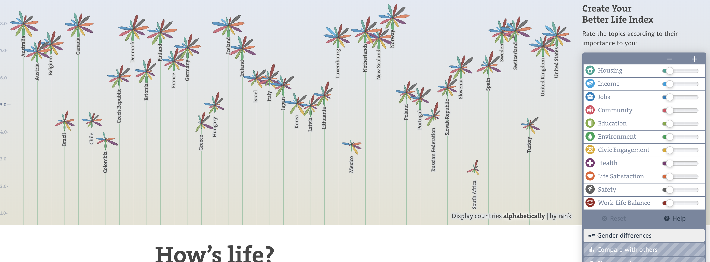
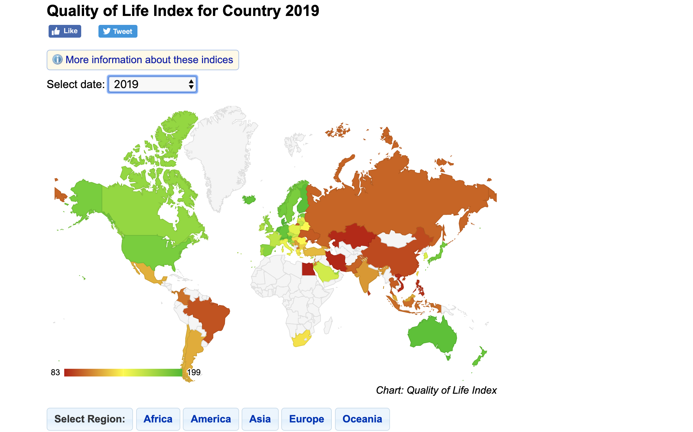
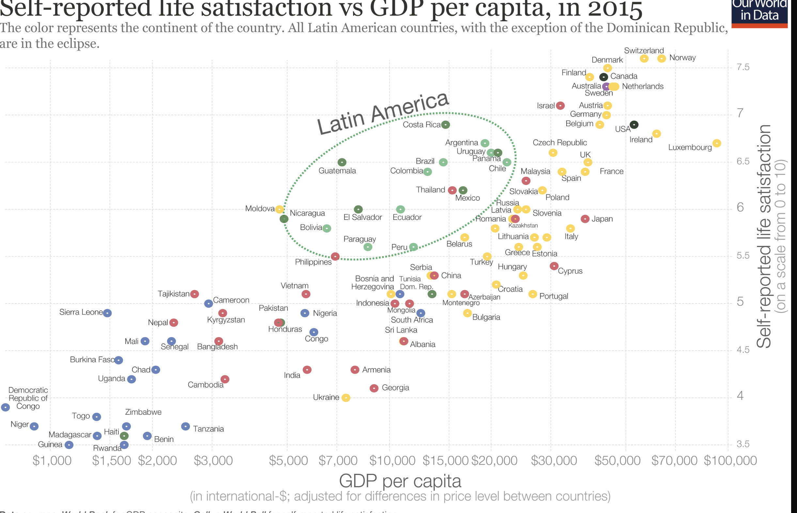
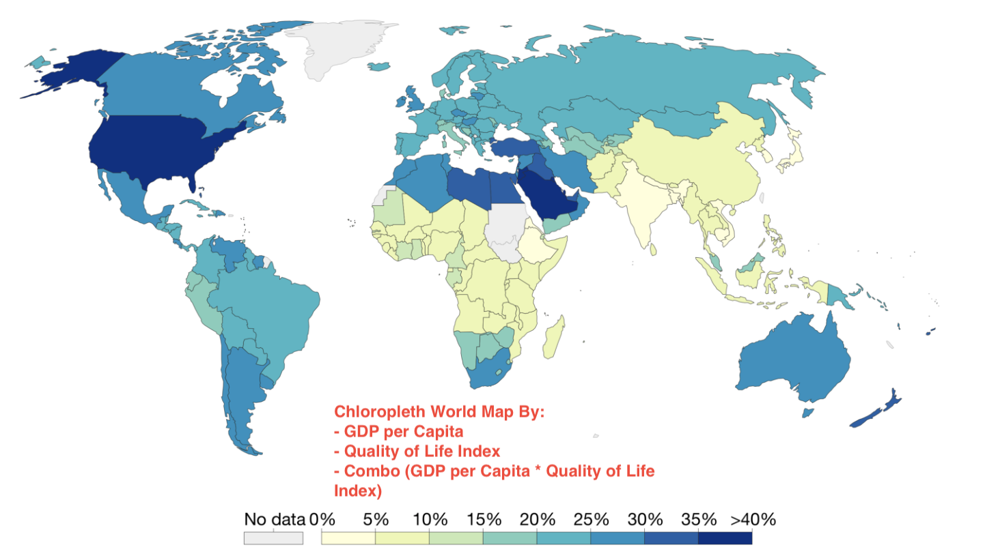

## PROJECT 3 PROPOSAL 

### Team 5: Matt, Michel, Neal, Kelly

### Topic and Rationale

What is happiness? Does happiness correlate with a country’s GDP per capita? Quality of Life can span from a person’s health, work life balance, safety or cost of living. Our project proposal brings datasets by country that can answer this question. 

## Data Sources

### Well-being Life Index:
https://stats.oecd.org/index.aspx?DataSetCode=BLI

* CSV download

### Quality of Life Index by Country:
https://www.numbeo.com/quality-of-life/ 

* Web scraping

### GDP Per Capita:
https://data.worldbank.org/indicator/NY.GDP.PCAP.CD?locations=VN

* CSV download

## Screenshots of Inspiring Viz

(1) http://www.oecdbetterlifeindex.org/

* Sorts the y-Axis by the interactive scale filter. Each category is a different node that will enlarge as you increase the scale.

2) https://www.numbeo.com/quality-of-life/rankings_by_country.jsp

* Cholorpleth Graph on Quality of Life index by country.

3) https://ourworldindata.org/happiness-and-life-satisfaction#health

* Scatter plot of GDP per capita and Life Satisfaction bubbles colored by region.

## Our visualization Sketch:

### WORLD MAP - Heat Map

* Scale by:
<ol>
  <li>Quality of Life Index</li>
  <li>GDP per Capita</li>
  <li>Combination Quality of Life Index x GDP per Capita</li>
 </ol>
 
 * Add YEAR filter

### Scatter Plot of Country

* X axis: GDP per Capita
* Y axis: (Choose From)
<ol>
  <li>Quality of Life Index</li>
<li>Health</li>
<li>Work Life Balance</li>
<li>Safety</li>
<li>Education</li>
<li>Etc.</li>
  </ol>

* Add YEAR filter

